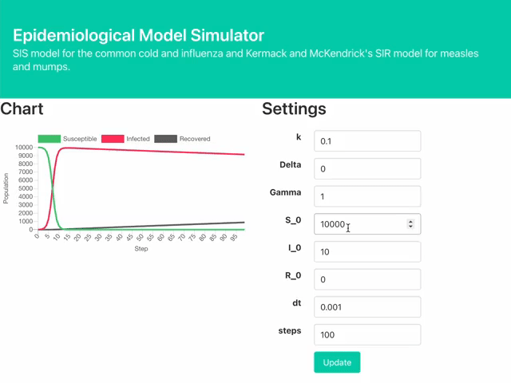

# Epidemiological Model Simulator



## Deployment
`elm make src/Main.elm --output deployment/main.js --optimize`

Upload `deployment/*` to S3 bucket `$CONTENT_BUCKET_NAME`.

`aws acm request-certificate --domain-name ${DOMAIN_NAME} --validation-method DNS --idempotency-token 20200513 --region us-east-1`

Complete validation

```
ACM_CERTIFICATE_ARN=<Your arn for the certificate>
DOMAIN_NAME=<your domain name>
LOGGING_BUCKET_NAME=<your logging bucket name>
CONTENT_BUCKET_NAME=<your content bucket name>

aws cloudformation deploy \
  --template-file cloudformation_templates/main.yml \
  --stack-name epidemiological-model-simulator \
  --parameter-override \
    DomainName=${DOMAIN_NAME} \
    LoggingBucketName=${LOGGING_BUCKET_NAME} \
    ContentBucketName=${CONTENT_BUCKET_NAME} \
    AcmCertificateArn=${ACM_CERTIFICATE_ARN}
```

Configure DNS server
